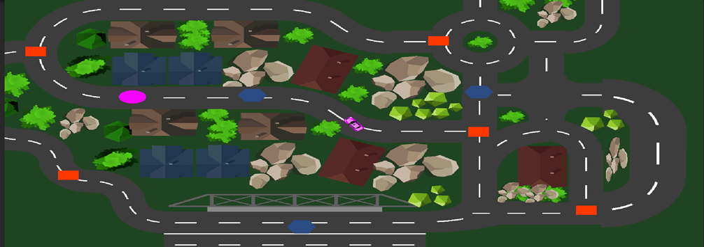

# better-deliveryman
Better Deliveryman is a game in Unity Game Engine. You can pick up packages and deliver them to the customers with your car in a neighbourhood.

**My Experiences**
In my recent game project, The Better Deliveryman, I further enhanced my Unity skills by developing my first PC-targeted driving simulation. This game places players in the role of a delivery driver, navigating through a neighborhood to collect and safely deliver packages. Players must manage their speed carefully, as the game includes temporary speed boosts as well as penalties for crashes that significantly decrease vehicle speed, adding a strategic and engaging dimension to the driving experience.

The project began similarly to my previous work, selecting and customizing suitable game assets to align with the game's visual style. Designing the game's level and neighborhood was an especially critical step and posed significant challenges due to it being my first experience with comprehensive level design. Through this process, I gained a deeper appreciation for how crucial level design is in creating a consistent and enjoyable player experience.

To enrich the visual dynamics, I developed a dedicated camera script and system that smoothly follows the player's vehicle throughout gameplay. This enhanced the game's immersive qualities, making the driving experience more dynamic and enjoyable.

Developing the primary character—a stylish vehicle—and the accompanying driver.cs script posed the project's most significant technical challenge. The script incorporated speed mechanics that dynamically changed due to temporary speed boosts and crash penalties. Managing these varying speed states required careful handling of player inputs and precise timing controls. To overcome these challenges, I effectively utilized coroutines, enabling timed speed changes and adding complexity and depth to gameplay mechanics.

Another major component of the game was the package collection and delivery system, managed through a dedicated delivery script. To provide intuitive visual feedback, I programmed the vehicle to change its color upon collecting a package, matching the package's color, and revert to its original color after successful delivery. This mechanic significantly enhanced both the visual and functional clarity of gameplay, reinforcing the player's delivery objectives.

Lastly, extensive debugging, performance optimization, and final adjustments such as refining camera distances and gameplay mechanics culminated in a polished final product. Publishing the project on GitHub allowed me to receive valuable feedback, further refining my skills in core game development techniques.

